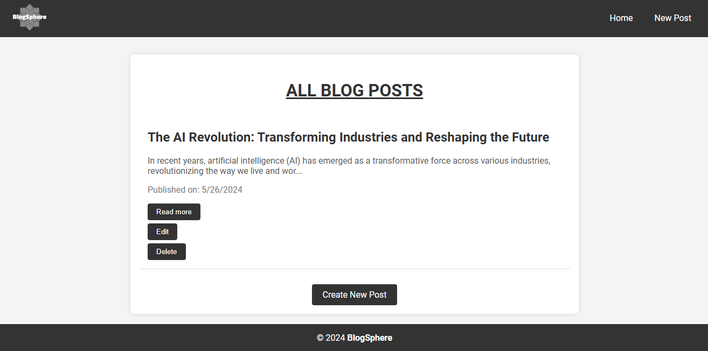

# BlogSphere

BlogSphere is a simple blog application built with Express, Node.js, and EJS. It allows users to create, view, edit, and delete blog posts. Note that posts will not persist between sessions as no database is used in this app. The application also focuses on styling to provide a good user experience.

## App Interface



## Features

- Create new blog posts
- View all blog posts
- Edit existing blog posts
- Delete blog posts
- Posts display the date they were created
- Responsive design for better user experience on different devices

## Table of Contents

- [Installation](#installation)
- [Usage](#usage)
- [File Structure](#file-structure)
- [Deployment](#deployment)
- [License](#license)

## Installation

1. **Clone the repository:**

   ```sh
   git clone https://github.com/yourusername/blogsphere.git
   ```

2. **Navigate to the project directory:**

   ```sh
   cd blogsphere
   ```

3. **Install the dependencies:**

   ```sh
    npm install
   ```

## Usage

1. **Start the server:**

   ```sh
   npm start
   ```

   or

   ```sh
   nodemon index.js
   ```

2. **Open your browser and go to:**

   ```sh
   http://localhost:3000
   ```

3. **Create a new post:**

   - Click on the "New Post" button
   - Enter the title and content of the post
   - Click on the "Publish" button

## Deployment

This application can be deployed to platforms like Heroku, Vercel, or Netlify. Make sure to update the `start` script in the `package.json` file to `node index.js` before deploying.
